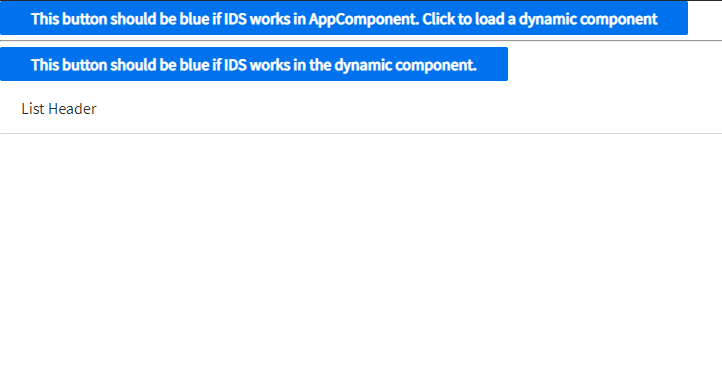
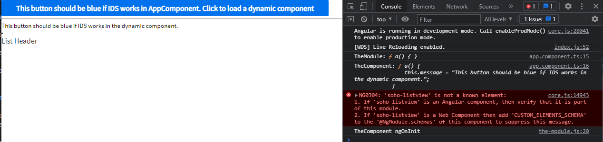

# ReproAngularDynamicLoading

Reproducing https://github.com/angular/angular/issues/42575

## To see everything work without AOT:
1. Run `npm i`
2. Run `ng serve --aot=false` (deprecated, but it's a simple way to switch it off).
3. Go to the served application.
4. See that it works:

## To see the issue:
1. Run `npm i`
2. Run `ng serve`
3. Go to the served application.
4. See the issue:
    1. The button diretive `soho-button` is not executed, so it is not blue.
    2. The `soho-listview` component throws an error and doesn't properly render.

